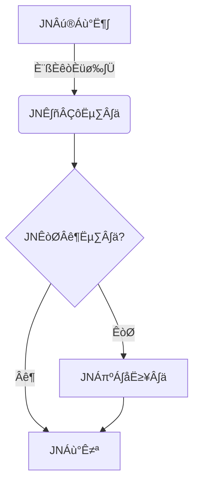

<!-- ### Hi there 👋 -->
<!--  -->

<h1 align="center">Hi 👋, I'm jiunjiun69</h1>

<details>
<summary>
  note
</summary>

<br />

[GitHub Docs](https://docs.github.com/en)

[digitalocean Docs](https://www.digitalocean.com/community/cheatsheets/how-to-use-git-a-reference-guide)

[gitignore](https://www.toptal.com/developers/gitignore)

[markdown-badges](https://ileriayo.github.io/markdown-badges/)

[badges pages](https://badges.pages.dev/)

[badge-collection](https://github.com/hawtim/badge-collection?tab=readme-ov-file)

[md-badges](https://github.com/inttter/md-badges)

</details>

```
                 ▄              ▄    
                ▌▒█           ▄▀▒▌   
                ▌▒▒█        ▄▀▒▒▒▐   
               ▐▄█▒▒▀▀▀▀▄▄▄▀▒▒▒▒▒▐   
             ▄▄▀▒▒▒▒▒▒▒▒▒▒▒█▒▒▄█▒▐   
           ▄▀▒▒▒░░░▒▒▒░░░▒▒▒▀██▀▒▌   
          ▐▒▒▒▄▄▒▒▒▒▒▒▒▒▒▒▒▒▒▒▒▀▄▒▌  
          ▌░░▌█▀▒▒▒▒▒▄▀█▄▒▒▒▒▒▒▒█▒▐  
         ▐░░░▒▒▒▒▒▒▒▒▌██▀▒▒░░░▒▒▒▀▄▌ 
         ▌░▒▒▒▒▒▒▒▒▒▒▒▒▒▒░░░░░░▒▒▒▒▌ 
        ▌▒▒▒▄██▄▒▒▒▒▒▒▒▒░░░░░░░░▒▒▒▐ 
        ▐▒▒▐▄█▄█▌▒▒▒▒▒▒▒▒▒▒░▒░▒░▒▒▒▒▌
        ▐▒▒▐▀▐▀▒▒▒▒▒▒▒▒▒▒▒▒▒░▒░▒░▒▒▐ 
         ▌▒▒▀▄▄▄▄▄▄▀▒▒▒▒▒▒▒░▒░▒░▒▒▒▌ 
         ▐▒▒▒▒▒▒▒▒▒▒▒▒▒▒▒▒░▒░▒▒▄▒▒▐  
          ▀▄▒▒▒▒▒▒▒▒▒▒▒▒▒░▒░▒▄▒▒▒▒▌  
            ▀▄▒▒▒▒▒▒▒▒▒▒▄▄▄▀▒▒▒▒▄▀   
              ▀▄▄▄▄▄▄▀▀▀▒▒▒▒▒▄▄▀     
                 ▀▀▀▀▀▀▀▀▀▀▀▀        
```


<!--  -->
<div align="center" class="container">
  <div class="row">
    <div class="col">
      
      &nbsp&nbsp&nbsp&nbsp&nbsp&nbsp&nbsp&nbsp&nbsp&nbsp&nbsp&nbsp&nbsp&nbsp&nbsp&nbsp&nbsp&nbsp&nbsp&nbsp&nbsp&nbsp&nbsp&nbsp&nbsp&nbsp&nbsp&nbsp&nbsp&nbsp&nbsp&nbsp&nbsp&nbsp
      
    </div>
  </div>
</div>

<h1 align="center">🏆 Github Achievements</h1>

<p align="center"></p>

<h1 align="center">⚡ Github Stats</h1>

| <a href="https://github.com/anuraghazra/github-readme-stats"></a> | <a href="https://github.com/anuraghazra/github-readme-stats"></a> |
| ------------- | ------------- |

<h1 align="center">🔎 Github Profile Details</h1>
<p align="center"></p>

<h1 align="center">🔥 Github Streaks</h1>
<p align="center"></p>

<!-- <h1 align="center">📊 Github Contribution Graph</h1>
<p align="center"><a href="#"></a></p> -->
 
 
 <h1 align="left">Languages I have used</h1>
 
 
 
 
 
 
 
 
 
 
 


 
 <h1 align="left">Some of the technologies I have worked with</h1>
 
 
 
 
 [](#)

 <h1 align="left"> Other / Workflow</h1>
 
 
 
 
 


 <h1 align="left"> Frameworks, Platforms and Libraries </h1>

 
 
 
 
 
 
 
 
 
 
 
 
 

 <h1 align="left"> Hosting/SaaS </h1>
 
 
 
 
 
 
 
 
 


 <h1 align="left"> DB </h1>
 
 
 
 
 
 
 
 
 
 
 


<h1 align="left"> Testing </h1>


<h1 align="left"> IDEs/Editors </h1>


 <h1 align="left"> Cloud Storage </h1>
 
 
 
 
 


<h1 align="left"> Blog </h1>


 <h1 align="left"> Game </h1>
 
 
 
 
 
 
 <h1 align="left">My favorite open source projects</h1>
 
 
 


 <h1 align="left">My favorite $$$</h1>
 
 

<div align="center">
  <h1 style="font-size: 2em; font-weight: bold; color: #FFD700; text-shadow: 2px 2px 8px #FF4500;">
    🚀 ✨💎🔥 HODL Bitcoin Forever 🔥💎✨ 🚀
  </h1>
</div>

<!-- Adding a GIF for additional flair -->
<div align="center">
  
  
  
  
  
  
</div>


<br />
<details>
<summary>
  leaf image
</summary>

<br />
<br />

</details>


 <br />

 
 <div align="center" class="container">
  <div class="row">
    <div class="col">
      
      &nbsp&nbsp&nbsp&nbsp&nbsp&nbsp&nbsp&nbsp&nbsp&nbsp&nbsp&nbsp&nbsp&nbsp&nbsp&nbsp&nbsp&nbsp&nbsp&nbsp&nbsp&nbsp&nbsp&nbsp&nbsp&nbsp&nbsp&nbsp&nbsp&nbsp&nbsp&nbsp&nbsp&nbsp
      
    </div>
  </div>
</div>


<!-- <p align="center"></p> -->

<!-- [](https://github.com/anuraghazra/github-readme-stats) -->
<!-- <p align="center"></p> -->

<!-- [](https://github.com/anuraghazra/github-readme-stats) -->
<!-- <p align="center"></p> -->


<!--
**jiunjiun69/jiunjiun69** is a ✨ _special_ ✨ repository because its `README.md` (this file) appears on your GitHub profile.

Here are some ideas to get you started:

- 🔭 I’m currently working on ...
- 🌱 I’m currently learning ...
- 👯 I’m looking to collaborate on ...
- 🤔 I’m looking for help with ...
- 💬 Ask me about ...
- 📫 How to reach me: ...
- 😄 Pronouns: ...
- ⚡ Fun fact: ...
-->
