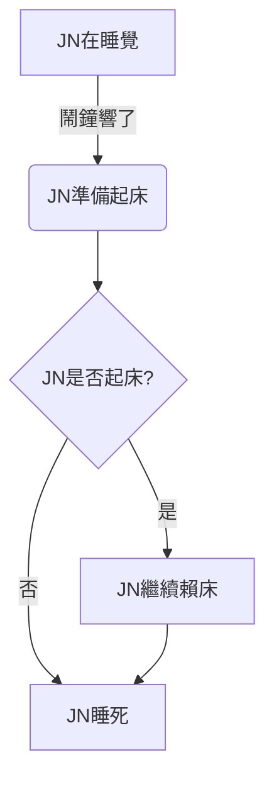

<!-- ### Hi there 👋 -->
<!--  -->

<h1 align="center">Hi 👋, I'm jiunjiun69</h1>

```mermaid
graph TD
    A[JN在睡覺] -->|鬧鐘響了| B(JN準備起床)
    B --> C{JN是否起床?}
    C -->|是| D[JN繼續賴床]
    C -->|否| E[JN睡死]
    D --> E[JN睡死]
```
<!--  -->

  

    

      
      &nbsp&nbsp&nbsp&nbsp&nbsp&nbsp&nbsp&nbsp&nbsp&nbsp&nbsp&nbsp&nbsp&nbsp&nbsp&nbsp&nbsp&nbsp&nbsp&nbsp&nbsp&nbsp&nbsp&nbsp&nbsp&nbsp&nbsp&nbsp&nbsp&nbsp&nbsp&nbsp&nbsp&nbsp
      
    

  

<h1 align="center">🏆 Github Achievements</h1>

<h1 align="center">⚡ Github Stats</h1>

|  |  |
| ------------- | ------------- |

<h1 align="center">🔎 Github Profile Details</h1>

<h1 align="center">🔥 Github Streaks</h1>

<h1 align="center">📊 Github Contribution Graph</h1>

 
 
 <h1 align="left">Languages I have used</h1>
 
 
 
 
 
 
 
 
 
 

 
 <h1 align="left">Some of the technologies I have worked with</h1>
 
 
 
 
 
 
 

 
 
 
 <h1 align="left">My favorite open source projects</h1>
 
 
 
 
 

  

    

      
      &nbsp&nbsp&nbsp&nbsp&nbsp&nbsp&nbsp&nbsp&nbsp&nbsp&nbsp&nbsp&nbsp&nbsp&nbsp&nbsp&nbsp&nbsp&nbsp&nbsp&nbsp&nbsp&nbsp&nbsp&nbsp&nbsp&nbsp&nbsp&nbsp&nbsp&nbsp&nbsp&nbsp&nbsp
      
    

  

 

  random images

 

<!-- 

 -->

 

<!-- 

 -->

<!--  -->
<!-- 

 -->

<!--  -->
<!-- 

 -->

<!--
**jiunjiun69/jiunjiun69** is a ✨ _special_ ✨ repository because its `README.md` (this file) appears on your GitHub profile.

Here are some ideas to get you started:

- 🔭 I’m currently working on ...
- 🌱 I’m currently learning ...
- 👯 I’m looking to collaborate on ...
- 🤔 I’m looking for help with ...
- 💬 Ask me about ...
- 📫 How to reach me: ...
- 😄 Pronouns: ...
- ⚡ Fun fact: ...
-->
